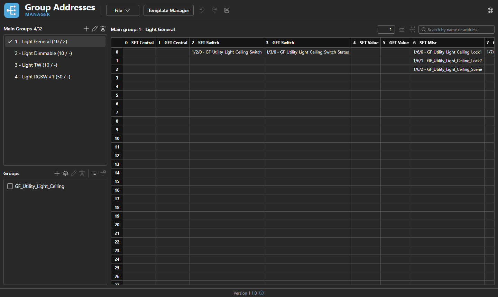
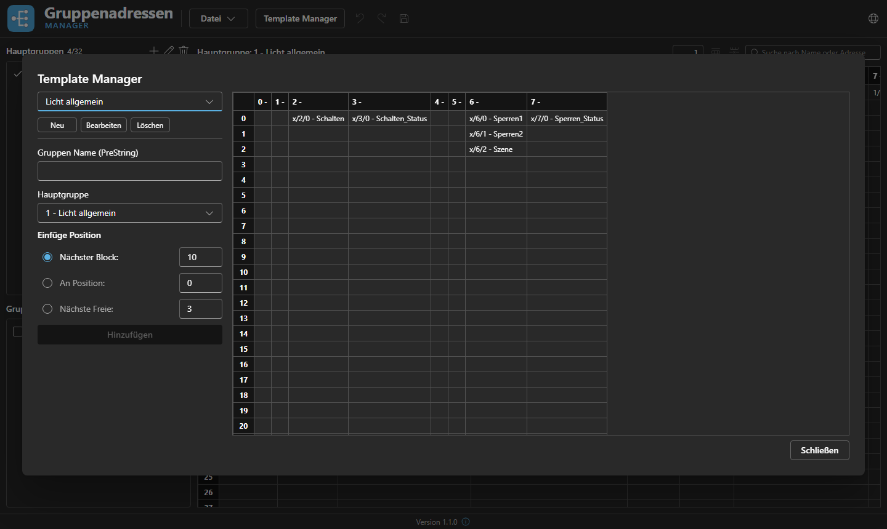

<div align="center">
  

  <p>A Windows desktop tool for creating and maintaining KNX group addresses –<br/>
  ETS-compatible CSV import/export, templates, undo/redo.</p>

  <p><a href="README.de.md">🇩🇪 Deutsche Version</a></p>
</div>

<br/>



<details>
<summary>Screenshot in German</summary>


</details>

## About the project

**GA Manager** manages the 3-level group address structure of a KNX project (main group /
middle group / sub group) outside of ETS – e.g. to plan an address structure up front and then
import it into ETS as a CSV file. The UI is available in German and English (switchable at
runtime via the language menu in the toolbar) and is saved and restored automatically.

## Features

### Main groups & group addresses

- Each main group (address 0–31) is edited in its own spreadsheet-like grid: 8 fixed middle-group
  columns × 256 rows (sub-addresses 0–255).
- Middle-group columns can be renamed (double-click the column header) and resized (drag the
  handle on the right edge of the header).
- A new group address is created simply by double-clicking an empty cell (or typing directly over
  a selected cell) and entering a name; committing with <kbd>Enter</kbd>, cancelling with
  <kbd>Esc</kbd>.
- The main-group list shows each group's address, name, configured default block length and the
  highest sub-address currently in use, and lets you add/edit/delete main groups (toolbar buttons,
  context menu, or <kbd>Delete</kbd> on the selected entry).

### Selecting and editing cells

- **Click** selects a single cell, **click-drag** selects a rectangular range, **Shift+click**
  extends the current selection, **Ctrl+click** toggles individual cells in/out of the selection.
- **Row headers** work the same way for whole rows (click, Shift+click, Ctrl+click).
- **Copy** (<kbd>Ctrl+C</kbd>) copies the selected range as tab/newline-separated text (like a
  spreadsheet), so it can be pasted into Excel or another main group.
- **Paste** (<kbd>Ctrl+V</kbd>): pasting a single value fills every selected cell with it (handy
  for bulk-renaming a range); pasting a multi-cell block writes it starting at the top-left corner
  of the current selection, skipping cells that would fall outside the grid.
- **Delete** (with a cell/range selected) removes the selected group addresses, leaving their
  positions empty; a confirmation dialog appears if the selection isn't empty.

### Inserting and deleting cells (with row shifting)

Separately from just clearing content, whole rows can be inserted or removed per column, shifting
the remaining rows to close or open a gap – e.g. to make room in the middle of an existing block
without renumbering everything by hand:

- **Insert cells**: select one or more cells, enter how many rows to insert (toolbar field) and
  click the insert-cells button. New empty rows are inserted at the topmost selected row per
  affected column, and everything at or below that row shifts down.
- **Delete cells** (<kbd>Ctrl+Delete</kbd> or the toolbar button): removes the selected cells and
  shifts everything below them up by one row per column, closing the gap. A confirmation dialog
  appears if any group address would be deleted.

### Search & filter

- The search box filters the grid to rows that match the search text in either the group address
  name or its address, highlighting the matching cells.
- Selecting one or more **groups** in the group panel filters the grid to rows containing a group
  address that belongs to one of the selected groups (highlighted in a different color); an
  "ungrouped" filter shows group addresses with no group at all. Both filters can be combined and
  cleared independently.

### Groups (tags)

Groups are free-form tags that span across main groups (e.g. by room or function) and are used
purely for filtering the grid – they don't affect the exported address structure:

- Create an empty group, or create one **from a template** (see below).
- Assign the currently selected group addresses to a group via the grid's right-click context menu.
- Rename or delete a group; deleting offers the choice to also delete its group addresses or only
  remove the tag and keep the addresses.

### Group templates

Templates capture a recurring set of group addresses (e.g. a standard switch/dim/status layout for
a light) so it doesn't have to be rebuilt by hand for every room:



- The Template Manager lets you create, rename and delete templates, and edit a template's group
  addresses in the same grid component used for main groups.
- To instantiate a template into a main group: pick the template and the target main group, enter
  a name prefix (prepended to every group address name from the template) and choose where it goes
  – the next free block (based on the main group's configured block length), a specific numeric
  position, or the next completely free address.
- Adding also creates a matching group (tag) for the newly inserted group addresses, and fails with
  an error message instead of overwriting anything if the addresses would collide with existing
  ones.

### Undo / redo

Every change (cell edits, inserts/deletes, group/template operations, main-group edits, …) is
tracked in an undo/redo history of up to 200 steps (<kbd>Ctrl+Z</kbd> / <kbd>Ctrl+Y</kbd>).

### Files & projects

- **Project files** (`.gaproj`, JSON) via New / Open / Save / Save As, with a recently-used-files
  list and an unsaved-changes indicator (asterisk in the window title) that prompts for
  confirmation before discarding changes.
- **CSV import/export** in the ETS Main/Middle/Sub column scheme, with automatic character-encoding
  detection (UTF-8 / Windows-1252) for files exported from ETS or Excel.
- A **sample project** (File → Open → Sample) seeds a small set of main groups and templates to
  explore the app; its content is in German or English depending on the current UI language.

## Tech stack

The app is a WPF window that embeds a React UI via WebView2:

| Project | Description |
|---|---|
| `GAManager.Desktop` | .NET 10 WPF host: window, native file dialogs (open/save/export/import), recent files. Embeds the React build as static files and loads them via WebView2 – no internet connection required. |
| `GAManager.Web` | React 19 + TypeScript + Vite + Fluent UI. Contains the entire domain model, undo/redo logic, CSV import/export and the i18n layer. Talks to the WPF host through a thin `postMessage` bridge ([`src/host/wpfBridge.ts`](src/GAManager.Web/src/host/wpfBridge.ts)). |

The React app can also run standalone in a browser (`npm run dev`) – it then falls back to
browser file download/upload instead of the WPF bridge, and the language selection falls back to
`localStorage` instead of the host's `config.json`.

## Development

Prerequisites: [.NET 10 SDK](https://dotnet.microsoft.com/download), [Node.js](https://nodejs.org/) (npm).

```bash
# React app in dev mode (hot reload, standalone in the browser at http://localhost:5173)
cd src/GAManager.Web
npm install
npm run dev

# Build & run the desktop app (builds and embeds the React app automatically)
dotnet build src/GAManager.Desktop/GAManager.Desktop.csproj
dotnet run --project src/GAManager.Desktop
```

Type-check / lint the web app:

```bash
cd src/GAManager.Web
npx tsc -b
npm run lint
```

## Tests

```bash
cd src/GAManager.Web
npm run test
```

## Release build

The app is published as a self-contained single-file EXE (no .NET runtime required on the target
machine):

```bash
dotnet publish src/GAManager.Desktop/GAManager.Desktop.csproj -c Release -r win-x64 --self-contained true -p:PublishProfile=FolderProfile
```

Output is under `src/GAManager.Desktop/bin/Release/net10.0-windows7.0/publish/win-x64/`.

## Project structure

```
src/
  GAManager.Desktop/  WPF host (window, file I/O, WebView2)
  GAManager.Web/      React UI (domain model, UI, CSV import/export, i18n)
branding/             Logo & icon (source files)
docs/                 Screenshots and other documentation media
.github/workflows/    CI (build & tests)
```
