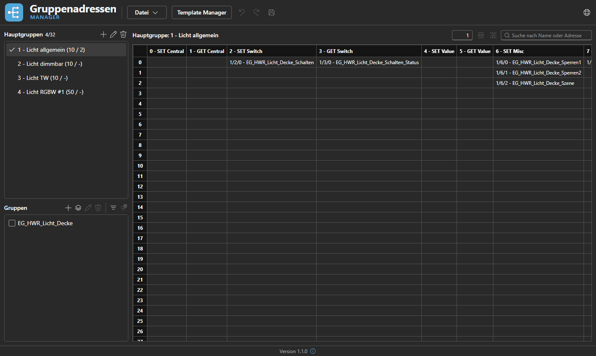

<div align="center">
  

  <p>Ein Windows-Desktop-Tool zum Anlegen und Pflegen von KNX-Gruppenadressen –<br/>
  ETS-kompatibler CSV-Import/Export, Vorlagen, Undo/Redo.</p>
</div>

<br/>



## Über das Projekt

**Gruppenadressen Manager** verwaltet die 3-Level-Gruppenadressstruktur eines KNX-Projekts
(Hauptgruppe / Mittelgruppe / Untergruppe) außerhalb von ETS – z. B. um eine Adressstruktur
vorab zu planen und anschließend als CSV in ETS zu importieren.

- **Hauptgruppen & Gruppenadressen** in einer Tabelle pro Hauptgruppe pflegen, mit Zellen
  einfügen/löschen, Mehrfachauswahl und Suche
- **Gruppen** (frei definierbare Tags quer über Hauptgruppen hinweg, z. B. nach Raum) zur
  Filterung des Grids
- **Gruppen-Templates**: wiederkehrende Adress-Layouts (z. B. Schalten/Dimmen/Status) als
  Vorlage anlegen und in beliebige Hauptgruppen einfügen
- **Undo/Redo** für alle Änderungen
- **CSV-Import/-Export** im ETS-Main/Middle/Sub-Schema, inkl. automatischer
  Zeichenkodierungs-Erkennung (UTF-8 / Windows-1252) für Dateien aus ETS/Excel
- **Projektdateien** (`.gaproj`) mit Zuletzt-verwendet-Liste und Änderungs-Tracking

## Technik

Die App ist ein WPF-Fenster, das eine React-Oberfläche über WebView2 einbettet:

| Projekt | Beschreibung |
|---|---|
| `GroupAddress.UI.WPF` | .NET-10-WPF-Host: Fenster, native Datei-Dialoge (Öffnen/Speichern/Export/Import), zuletzt verwendete Dateien. Bettet den React-Build als statische Dateien ein und lädt sie per WebView2 – keine Internetverbindung nötig. |
| `GroupAddress.Web` | React 19 + TypeScript + Vite + Fluent UI. Enthält das komplette Domänenmodell, die Undo/Redo-Logik sowie CSV-Import/-Export. Kommuniziert mit dem WPF-Host über eine schmale `postMessage`-Bridge ([`src/host/wpfBridge.ts`](src/GroupAddress.Web/src/host/wpfBridge.ts)). |
| `GroupAddress.Core` | Geteilte .NET-Bibliothek mit einem einfachen Domänenmodell (`Project`, `MainGroup`, `Group`, `Address`, …). |

Die React-App lässt sich auch eigenständig im Browser starten (`npm run dev`) – dann greifen
Fallbacks (Datei-Download/-Upload) anstelle der WPF-Bridge.

## Entwicklung

Voraussetzungen: [.NET 10 SDK](https://dotnet.microsoft.com/download), [Node.js](https://nodejs.org/) (npm).

```bash
# React-App im Dev-Modus (Hot Reload, eigenständig im Browser unter http://localhost:5173)
cd src/GroupAddress.Web
npm install
npm run dev

# Desktop-App bauen & starten (baut die React-App automatisch mit und bettet sie ein)
dotnet build src/GroupAddress.UI.WPF/GroupAddress.UI.WPF.csproj
dotnet run --project src/GroupAddress.UI.WPF
```

Typecheck / Lint der Web-App:

```bash
cd src/GroupAddress.Web
npx tsc -b
npm run lint
```

## Tests

```bash
# .NET (GroupAddress.Core)
dotnet test tests/GroupAddress.Core.Tests

# React-App
cd src/GroupAddress.Web
npm run test
```

## Release-Build

Die App wird als self-contained Single-File-EXE veröffentlicht (keine .NET-Runtime auf dem
Zielrechner nötig):

```bash
dotnet publish src/GroupAddress.UI.WPF/GroupAddress.UI.WPF.csproj -c Release -r win-x64 --self-contained true -p:PublishProfile=FolderProfile
```

Ergebnis liegt unter `src/GroupAddress.UI.WPF/bin/Release/net10.0-windows7.0/publish/win-x64/`.

## Projektstruktur

```
src/
  GroupAddress.Core/       Geteiltes .NET-Domänenmodell
  GroupAddress.UI.WPF/     WPF-Host (Fenster, Datei-I/O, WebView2)
  GroupAddress.Web/        React-Oberfläche (Domänenlogik, UI, CSV-Import/-Export)
tests/
  GroupAddress.Core.Tests/ xUnit-Tests für GroupAddress.Core
branding/                  Logo & Icon (Quelldateien)
docs/                      Screenshots & sonstige Dokumentationsmedien
.github/workflows/         CI (Build & Tests)
```
